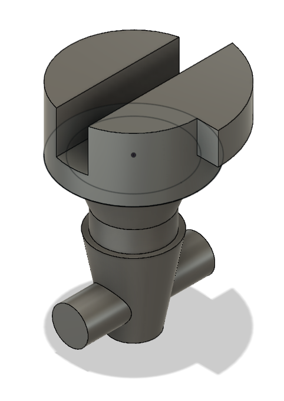
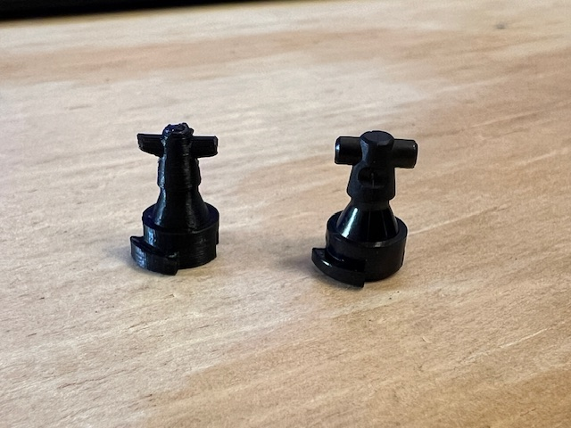
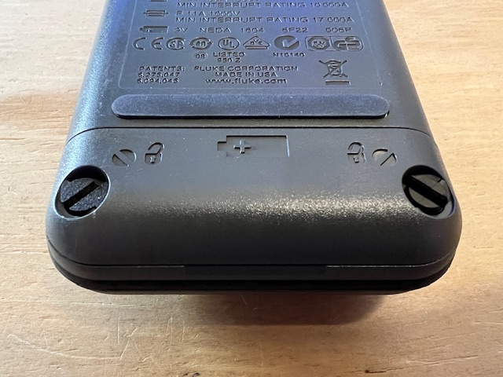
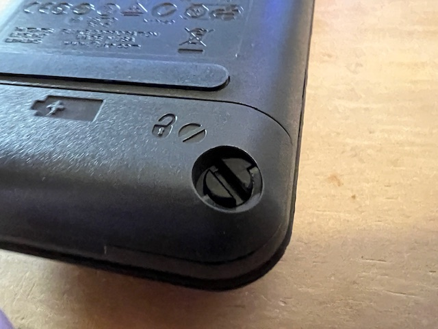

# Fluke 87-V multimeter battery cover replacement screw 
Does your Fluke 87V have a broken screw for the battery door? Fear not! Just 3D print this screw and you'll be back to multimetering in no time.

The replacement screw:

A comparison of this screw vs the OEM screw supplied with the meter:

An installed view of the battery cover:

A detailed view of the replacement screw:

A detailed view of the OEM screw:

